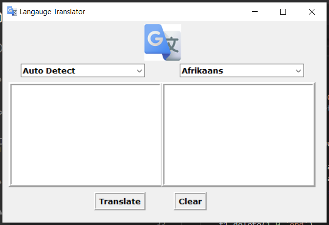
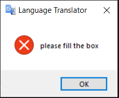
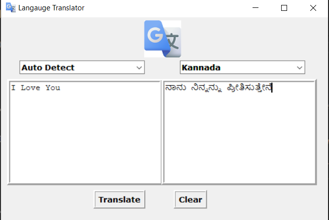
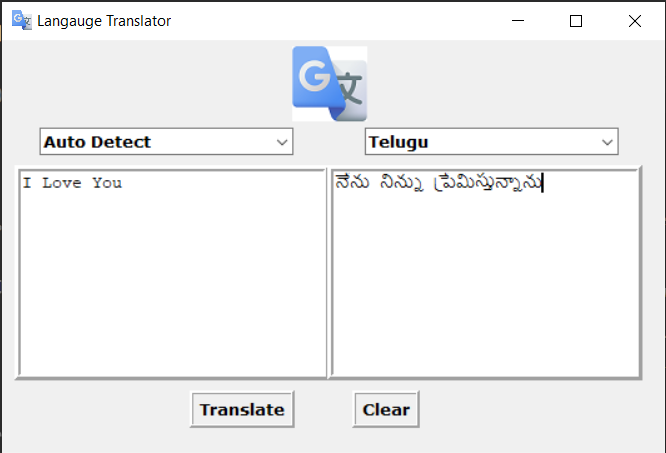
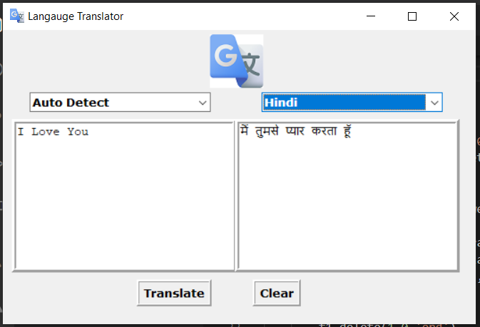

# GUI-Translator

### This tkinter application takes English statement and converts the given statement to selected language

## Tech stack used

### Python
### tkinter-GUI

### Snapshots:

### The above page is landing screen

### The above error message is displayed if no input is given

### Example-1

### Example-2

### Example-3

                                                 
